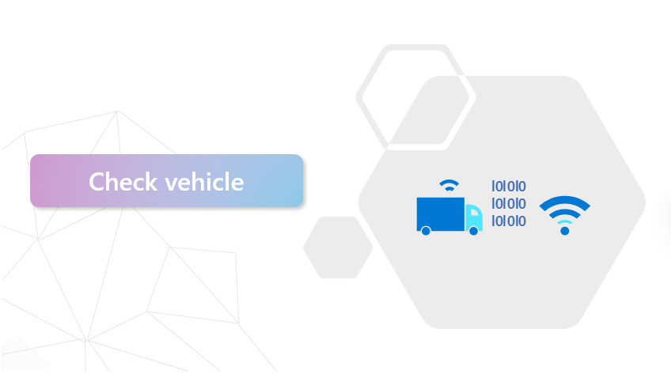
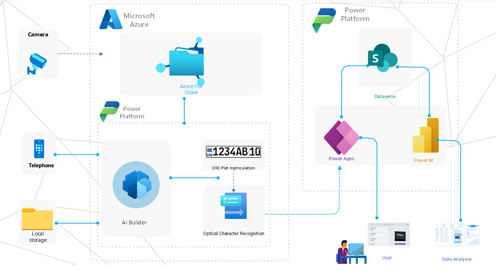
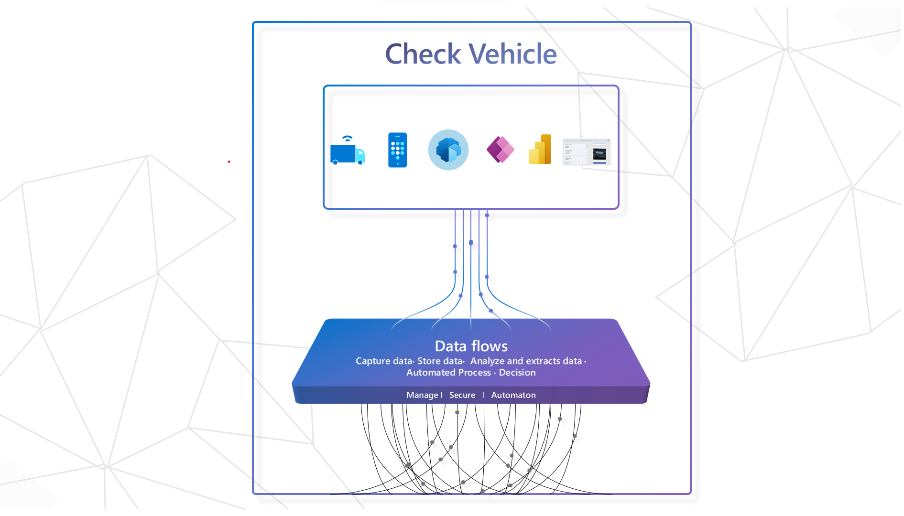

## Introduction

Enterprises collect massive amounts of data every day, much of it in unstructured formats. Enterprises across industries can reap significant benefits by leveraging and refining the insights contained in this raw data.
Data collection and analysis are not recent phenomena. Nevertheless, significant changes have occurred in some areas of computing over the past few decades, such as in the area of ​​surveillance through modern institutions.
With advancements in artificial intelligence, some problems that were complex to grasp have become easy to solve from an integration perspective; The solutions are based on different artificial intelligence through different platforms such as Azure Artificial Intelligence Services, Cognitive Services, AI Builder services, machine learning, language studio and many others. These services have brought many solutions in the daily use of human work. This is how we are going to adopt a solution for our check vehicle project which will make it possible to control license plates to fight against theft, ensure road safety but also have necessary information concerning the driver, vehicles and motorcycles. In the event of serious accidents.

## Problem
Despite the government's objectives on the regulation of road traffic, we are faced with very big problems concerning road safety, more precisely such as that of identifying certain documents of vehicles, motorcycles which have been stolen; in case of accidents how to have the necessary information of the car or the driver in question if the person had no document on him; be able to identify if the documents provided are really varied or are false and also know if the license plate is registered.
To overcome these problems, we proposed our check vehicle project with Microsoft services and technologies.
 
## Solution
Road safety systems are becoming more and more affordable with advances in camera technology, surveillance systems and the implementation of artificial intelligence.
Through the emergence of artificial intelligence we find the knowledge exploration category which improves the understanding of content by extracting information from compartmentalized, structured and unstructured content, using a range of artificial intelligence services. personalized and pre-trained such as computer vision and natural language processing. 
Which includes 3 steps such as  assimilation, enrich and discover.

## Architecture

## Details

The check vehicle system is a powerful tool that utilizes the latest in image recognition technology to extract text from a vehicle's license plate. The extracted text is then used to search a database to determine if the vehicle is registered or not. The system is built using Power Apps, AI Builder and SharePoint List for database, which provides a user-friendly interface and robust capabilities for image recognition. Additionally, the project utilizes Azure File to store the data, allowing for increased scalability, availability, and security.

This system is designed to be highly efficient and able to process multiple vehicles in a short period of time. It can easily be integrated with existing databases and systems, making it a versatile solution for any organization that needs to check the registration status of vehicles.

The system's powerful image recognition capabilities allow it to accurately extract text from license plates even in challenging conditions such as low lighting or glare. This makes it ideal for use in various environments such as parking lots or traffic control. Additionally, the system's use of Azure File ensures that the data is stored and accessed securely in the cloud.

Overall, the prototype check vehicle system is a powerful and innovative solution that can revolutionize the way we manage and track vehicle registration. It is fast, efficient, accurate and secure, making it the perfect choice for any organization looking to streamline their vehicle registration process.

## Demostration

- 
- 
- 

## Technologies

* Azure Cognitive Services (Computer Vision): Analyze images and extract data
* Azure Blob Storag : store unstructured Data
* Power platform
  - Power Apps: Mange and automate Process
  - Power BI: Visualising Data and forecasting with AI 
  - Dataverse : for storing Data

* [Explore Power Platform](https://powerplatform.microsoft.com/en-us/)
* [Explore Power Apps](https://powerapps.microsoft.com/en-us/)
* [Explore Power BI](https://powerbi.microsoft.com/en-us/)
* [Explore AI Builder](https://learn.microsoft.com/en-us/ai-builder/overview)

Visit [imaginecup.microsoft.com](https://imaginecup.microsoft.com/) to learn more!

---- 

Microsoft projects adopt the [Microsoft Open Source Code of Conduct](https://opensource.microsoft.com/codeofconduct/). For more information see the [Code of Conduct FAQ](https://opensource.microsoft.com/codeofconduct/faq/).
