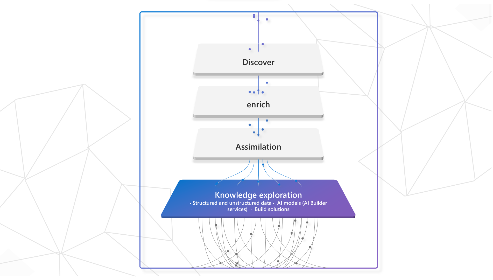
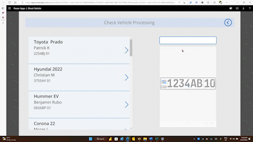

## Introduction

Enterprises collect massive amounts of data every day, much of it in unstructured formats. Enterprises across industries can reap significant benefits by leveraging and refining the insights contained in this raw data.
Data collection and analysis are not recent phenomena. Nevertheless, significant changes have occurred in some areas of computing over the past few decades, such as in the area of ​​surveillance through modern institutions.
With advancements in artificial intelligence, some problems that were complex to grasp have become easy to solve from an integration perspective; The solutions are based on different artificial intelligence through different platforms such as Azure Artificial Intelligence Services, Cognitive Services, AI Builder services, machine learning, language studio and many others. These services have brought many solutions in the daily use of human work. This is how we are going to adopt a solution for our check vehicle project which will make it possible to control license plates to fight against theft, ensure road safety but also have necessary information concerning the driver, vehicles and motorcycles. In the event of serious accidents.

## Problem
Despite the government's objectives on the regulation of road traffic, we are faced with very big problems concerning road safety, more precisely such as that of identifying certain documents of vehicles, motorcycles which have been stolen; in case of accidents how to have the necessary information of the car or the driver in question if the person had no document on him; be able to identify if the documents provided are really varied or are false and also know if the license plate is registered.
To overcome these problems, we proposed our check vehicle project with Microsoft services and technologies.
 
## Solution
Road safety systems are becoming more and more affordable with advances in camera technology, surveillance systems and the implementation of artificial intelligence.
Through the emergence of artificial intelligence we find the knowledge exploration category which improves the understanding of content by extracting information from compartmentalized, structured and unstructured content, using a range of artificial intelligence services. personalized and pre-trained such as computer vision and natural language processing. 
Which includes 3 steps such as  assimilation, enrich and discover.

For the realization of our work, we will use the exploration of knowledge to process the images captured from the camera of the device or the telephone which will be automated and managed through power apps which will be a favourable means to effectively reinforce the level of surveillance and control of automobile license plates but also allow a reduced workforce of the agents guaranteeing a better maximization of the time of automatic and authentic identification of the necessary information concerning certain documents on board or held by the driver but also the equipment vehicle concerned. With Power Apps which is a component of Power Platform uses the Dataverse database which is secure and scalable to store data; about our prototype we will combine with SharePoint list. For the visualization of information and decision making we will use Power BI. All these solutions will be part of our Check vehicle project to improve lifestyles in road traffic.
We will explain in detail in the architecture

## Architecture

Cameras capture real-time video images and Azure File Storage will be used to store captured images, across unstructured data storage this is a solution for big mount of data that allow flexibility, availability and scalability.
AI Builder offers many possibilities for Artificial Intelligence (AI) solutions.  And one of them that will be used for our solution it’s Text Recognition, which will be used to display images of different vehicles with analysis functionalities with Optical Character Recognition to extract the texts issue from the license plate.

The prototype check vehicle system is a powerful tool that utilizes the latest in image recognition technology to extract text from a vehicle's license plate. The extracted text is then used to search a database to determine if the vehicle is registered or not. The system is built using Power Apps, AI Builder and SharePoint List for database, which provides a user-friendly interface and robust capabilities for image recognition. Optionally, the project can utilize Azure File to store the data, allowing for increased scalability, availability, and security specially for large enterprises big mount of data.
Power BI will allow to analyse and have the visuals on all vehicles record, those that are in the term of insurance, also to be able to locate the vehicles according to the provinces from which they come.

## Demostration

**Gif by** [Mohit Jaisal](https://linkedin.com/in/mohitjaisal)

> 🎥 Click the image above for a video about the project and the folks who created it!

---

## Technologies

* Azure Cognitive Services (Computer Vision): Analyze images and extract data
* Azure Blob Storag : store unstructured Data
* Power platform
  - Power Apps: Mange and automate Process
  - Power BI: Visualising Data and forecasting with AI 
  - Dataverse : for storing Data

* [Explore Power Platform](https://powerplatform.microsoft.com/en-us/)
* [Explore Power Apps](https://powerapps.microsoft.com/en-us/)
* [Explore Power BI](https://powerbi.microsoft.com/en-us/)
* [Explore AI Builder](https://learn.microsoft.com/en-us/ai-builder/overview)

Visit [imaginecup.microsoft.com](https://imaginecup.microsoft.com/) to learn more!

---- 

Microsoft projects adopt the [Microsoft Open Source Code of Conduct](https://opensource.microsoft.com/codeofconduct/). For more information see the [Code of Conduct FAQ](https://opensource.microsoft.com/codeofconduct/faq/).
